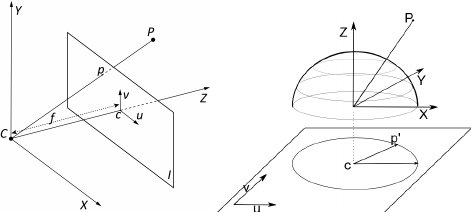

# Sensor Calibration 

This section aims to provide a sample on how to do the calibration with a different coefficient and verify the performance of the calibration results.

Sensor intrinsic and extrinsic calibrations are the most critical factors in getting the higher precision results in the process, such as stereo matching, SLAM, multi-sensor fusion. 

We use a 128(diagonal) x 96(horizontal) x 69(vertical) degree FOV [lens](https://www.lensation.de/pdf/B5M3618C.pdf) for the stereo camera to ease the process of feature tracking over multiple frames. By convention, the angle of view of a fisheye lens is expected to be [between 100 and 180 degrees](https://en.wikipedia.org/wiki/Fisheye_lens).  Technically, either the [pinhole camera model](https://en.wikipedia.org/wiki/Pinhole_camera_model) and [fisheye model](https://en.wikipedia.org/wiki/Fisheye_lens) can be used. The different between fisheye and pinhole can be seen from  [Fig. 1](#a-Pinhole-camera-model-b-Fisheye-camera-model_W640)


<a name="a-Pinhole-camera-model-b-Fisheye-camera-model_W640"></a>
<p align="center">
    
</p>
<p style="text-align: center;">Fig 1. Pinhole camera model vs Fisheye camera model</p>

The pinhole camera model is used in our provided calibration results (fx, fy, cx, cy, k1, k2, d1, d2). But, there are many other choices of number of coefficients and models (atan, pinhole, etc.) that one might need when exploring some existing algorithms. 

You can download our calibration datasets for stereo and inertial sensors from the [github repo](https://github.com/ntu-aris/viral_eval). The chessboard pattern should be enough for the atan model used in PTAM and fisheye camera model. The QR code-based pattern in the visual-inertial calibration dataset should provide enough features for more modern models and approaches in the literature.


## Calibration with MATLAB

Calibration in MATLAB is one of eaisest way of getting what you wanted. To start the calibration, you need to run the app by calling 
```matlab
stereoCameraCalibrator
```
Then load the image by GUI as illustrated in  [Fig. 2](#matlabcalibration1)

<a name="matlabcalibration1"></a>
<p align="center">
    
</p>
<p style="text-align: center;">Fig 2. MATLAB stereo calibration process 1</p>


Then enter the correct chessboard size of 80mm as shown in  [Fig. 3](#matlabcalibration2)

<a name="matlabcalibration2"></a>
<p align="center">
    
</p>
<p style="text-align: center;">Fig 3. MATLAB stereo calibration process 2</p>


There are different options in calibration parameter settings as shown in [Fig. 4](#matlabcalibration3). In this sample case, we aim to discover the 3rd coefficients in the distortion parameter. After selecting the parameter, press the calibrate button on the top

<a name="matlabcalibration3"></a>
<p align="center">
    
</p>
<p style="text-align: center;">Fig 4. MATLAB stereo calibration process 3</p>

After the calibration, the reprojection error and 3D view will be shown below in [Fig. 5](#matlabcalibration4). You may press the show recertified button to view if the lines indeed cross over the same features in the image pair.

<a name="matlabcalibration4"></a>
<p align="center">
    
</p>
<p style="text-align: center;">Fig 5. MATLAB stereo calibration process 4</p>

Some of the images yield higher reprojection error, and it is possible to remove part of the images by dragging the line on the reprojection figure to achieve a lower reprojection error  as illustrated in  [Fig. 6](#matlabcalibration5) . 

<a name="matlabcalibration5"></a>
<p align="center">
    
</p>
<p style="text-align: center;">Fig 6. MATLAB stereo calibration process 5</p>

After that you can export the camera parameters to a file. 

Please take note that MATLAB notation and OpenCV notation are different. To use the MATLAB result in OpenCV you need to transpose the projection matrix and rotation matrix. 
See this [link](https://stackoverflow.com/questions/46651936/convert-between-matlab-stereoparameters-and-opencv-stereorectify-stereo-calibrat/50925828#50925828) for details


To use MATLAB to calibrate a fisheye model, you may follow the command line instruction [here](mathworks.com/help/vision/ug/fisheye-calibration-basics.html)

First call
```matlab
cameraCalibrator
```
then load the image and select the Fisheye. At last calibrate and show the result. The camera calibration GUI is very similar to the stereo calibrate case.

## Calibration with OpenCV

OpenCV calibration is more complicated and often requires quite sometime to read and understand.

So to find pattern in chess board, we can use the function, `cv.findChessboardCorners()`.
The chessboard pattern we are using is 9x6 size patten with each square tape measured to be 80mm

```python 
import numpy as np
import cv2 as cv
import glob
# termination criteria
criteria = (cv.TERM_CRITERIA_EPS + cv.TERM_CRITERIA_MAX_ITER, 30, 0.001)
# prepare object points, like (0,0,0), (1,0,0), (2,0,0) ....,(6,5,0)
objp = np.zeros((6*7,3), np.float32)
objp[:,:2] = np.mgrid[0:7,0:6].T.reshape(-1,2)
# Arrays to store object points and image points from all the images.
objpoints = [] # 3d point in real world space
imgpoints = [] # 2d points in image plane.
images = glob.glob('*.png')
for fname in images:
    img = cv.imread(fname)
    gray = cv.cvtColor(img, cv.COLOR_BGR2GRAY)
    # Find the chess board corners
    ret, corners = cv.findChessboardCorners(gray, (9,6), None)
    # If found, add object points, image points (after refining them)
    if ret == True:
        objpoints.append(objp)
        corners2 = cv.cornerSubPix(gray,corners, (11,11), (-1,-1), criteria)
        imgpoints.append(corners)
        # Draw and display the corners
        cv.drawChessboardCorners(img, (9,6), corners2, ret)
        cv.imshow('img', img)
        cv.waitKey(500)
cv.destroyAllWindows()
```

This script will draw the detected pattern and show it in display window

Now that we have our object points and image points, we are ready to go for calibration. We can use the function `cv.calibrateCamera()`, which returns the camera matrix, distortion coefficients, rotation and translation vectors etc.


```python 
ret, K, D, rvecs, tvecs = cv.calibrateCamera(objpoints, imgpoints, gray.shape[::-1], None, None)
```


Now, we can take an image and undistort it. OpenCV comes with two methods for doing this. However first, we can refine the camera matrix based on a free scaling parameter using `cv.getOptimalNewCameraMatrix()`.

So, we take a new image (0034.png in this case.)

```python 
img = cv.imread('0034.png')
h,  w = img.shape[:2]
newcameramtx, roi = cv.getOptimalNewCameraMatrix(K, D, (w,h), 1, (w,h))
```

The easier way is to use the opencv internal function and it returns the undistored image.

```python 
# undistort
dst = cv.undistort(img, K, D, None, newcameramtx)
# crop the image
x, y, w, h = roi
dst = dst[y:y+h, x:x+w]
cv.imwrite('calibresult.png', dst)
```


After this process, you should able to obtain valid intrinsically image pairs, where straight lines do appear straight.

To obtain the extrinsics, first load the left and right image sequence with detected corners, then run
```python 
ret, K1, D1, K2, D2, R, T, E, F = cv2.stereoCalibrate(objp, leftp, rightp, K1, D1, K2, D2, image_size, criteria, flag)
```
For extrinsic parameters, there are two ways to obtain them. The first one is to optimize for intrinsics and extrinsics jointly. The second is to optimize extrinsics only. The first method can often achieve low reprojection error but can have poor stereo matching results when dealing with a large baseline. When there is a large baseline, a large section of the image is not observable on the other camera feed (e.g the left strom trooper head in [Fig. 4](#matlabcalibration3) ) .  The second method often has a larger reprojection error but can deal with a large baseline well. The calibration method and other options are controlled by a list of flags shown below


* `CV_CALIB_FIX_INTRINSIC`: Tells the stereoCalibrate function to not guess the individual intrinsics for each camera
* `CV_CALIB_USE_INTRINSIC_GUESS`: The intrinsics will be used as guesses but optimized again
* `CV_CALIB_FIX_ASPECT_RATIO`: Fixing the aspect ratio.
* `CV_CALIB_SAME_FOCAL_LENGTH`: Calibrate the focal length and set Fx and Fy the same calibrated result.
* `CV_CALIB_ZERO_TANGENT_DIST`: Remove the tangential distortions.
* `CV_CALIB_FIX_PRINCIPAL_POINT`, `CV_CALIB_FIX_FOCAL_LENGTH`, `CV_CALIB_FIX_K1`, …, `CV_CALIB_FIX_K6`: With a combination of `CV_CALIB_FIX_PRINCIPAL_POINT`, `CV_CALIB_FIX_FOCAL_LENGTH` and * `CV_CALIB_FIX_K1`,..., `CV_CALIB_FIX_K6` you get a little of play about which parameters are fixed and which are optimized again


Based on calibrated extrinsics and intrinsics, the coefficients K1 K2 R1 and R2 can be found with their ROI. The rectified view can be found by
```python 
R1, R2, P1, P2, Q, roi_left, roi_right = cv2.stereoRectify(K1, D1, K2, D2, image_size, R, T, flags=cv2.CALIB_ZERO_DISPARITY, alpha=0.9)
leftMapX, leftMapY = cv2.initUndistortRectifyMap(K1, D1, R1, P1, (width, height), cv2.CV_32FC1)
left_rectified = cv2.remap(leftFrame, leftMapX, leftMapY, cv2.INTER_LINEAR, cv2.BORDER_CONSTANT)
rightMapX, rightMapY = cv2.initUndistortRectifyMap(K2, D2, R2, P2, (width, height), cv2.CV_32FC1)
right_rectified = cv2.remap(rightFrame, rightMapX, rightMapY, cv2.INTER_LINEAR, cv2.BORDER_CONSTANT)
```


## Verification of stereo calibration (working in progress)

## Projecting pointclouds into camera image (working in progress)
